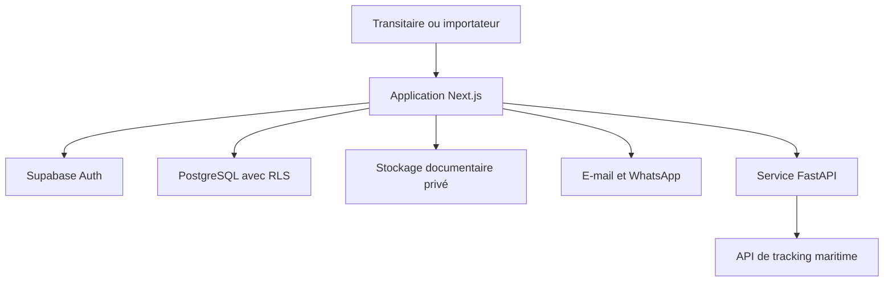

# SaaS de gestion logistique et douanière

Plateforme SaaS B2B destinée aux transitaires et aux PME importatrices afin de centraliser le suivi des expéditions, les documents douaniers et la communication avec les clients.

> **Statut :** conception et prototypage en cours.

## Problème

Dans le secteur de l'import-export, de nombreuses opérations sont encore suivies avec des tableurs, des documents dispersés et des échanges WhatsApp. Ce fonctionnement limite la visibilité en temps réel et peut entraîner des retards de dédouanement, des erreurs documentaires et des pénalités portuaires.

## Solution

La plateforme doit permettre de piloter chaque dossier depuis le départ d'usine jusqu'à la livraison finale à partir d'un espace unique et sécurisé.

### MVP prévu

- Tableau de bord des expéditions et conteneurs
- Parcours par étapes et suivi des échéances
- Coffre-fort documentaire pour les Bill of Lading, factures et déclarations douanières
- Détection des documents manquants
- Portail client en libre-service
- Notifications automatiques par e-mail et WhatsApp
- Historique des événements et journal d'audit
- Gestion des entreprises, utilisateurs, rôles et autorisations

## Architecture cible du MVP

- **Application web :** Next.js, React et TypeScript
- **Interface :** Tailwind CSS
- **Base de données :** Supabase PostgreSQL
- **Authentification :** Supabase Auth
- **Documents :** Supabase Storage avec buckets privés
- **Backend initial :** Next.js Route Handlers et Server Actions
- **Hébergement :** Vercel
- **CI/CD :** GitHub Actions
- **Sécurité :** SonarQube, Trivy, analyse des dépendances et détection de secrets
- **Développement local :** Docker

Un service **Python/FastAPI** pourra être ajouté pour les intégrations maritimes, l'analyse documentaire, l'OCR et les traitements asynchrones. **AWS** et **Terraform** seront introduits lorsque le projet nécessitera une infrastructure plus personnalisée.

## Architecture fonctionnelle

## Sécurité et DevSecOps

Le projet suit une approche Security by Design :

- séparation des données entre entreprises avec Row Level Security ;
- principe du moindre privilège ;
- stockage privé et liens de téléchargement temporaires ;
- contrôle des types et tailles de fichiers ;
- journalisation des actions sensibles ;
- secrets exclus du code source ;
- analyses SAST et scans de vulnérabilités dans la CI/CD ;
- tests automatiques avant déploiement ;
- sauvegarde et restauration des données ;
- mises à jour contrôlées des dépendances.

## Modèle économique

Abonnement B2B adapté au volume mensuel de conteneurs ou de dossiers traités par chaque entreprise.

## Prochaines étapes

1. Modéliser le parcours réel d'un conteneur avec un professionnel du transit
2. Définir les rôles et les règles d'accès
3. Concevoir le schéma PostgreSQL multi-tenant
4. Développer le tableau de bord et la gestion des dossiers
5. Ajouter le coffre-fort documentaire
6. Tester le MVP sur des opérations réelles
7. Intégrer progressivement les API de tracking et les notifications
